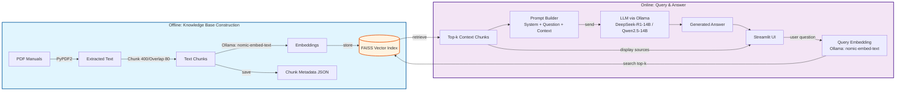

```mermaid
flowchart LR
    %% Offline preprocessing
    subgraph OFFLINE[Offline: Knowledge Base Construction]
        A[PDF Manuals] -->|PyPDF2| B[Extracted Text]
        B -->|Chunk 400/Overlap 80| C[Text Chunks]
        C -->|Ollama: nomic-embed-text| D[Embeddings]
        D -->|store| E[(FAISS Vector Index)]
        C -->|save| F[Chunk Metadata JSON]
    end

    %% Online inference
    subgraph ONLINE[Online: Query & Answer]
        G[Streamlit UI] -->|user question| H[Query Embedding<br/>Ollama: nomic-embed-text]
        H -->|search top-k| E
        E -->|retrieve| I[Top-k Context Chunks]
        I --> J[Prompt Builder<br/>System + Question + Context]
        J -->|send| K[LLM via Ollama<br/>DeepSeek-R1-14B / Qwen2.5-14B]
        K --> L[Generated Answer]
        L --> G
        I -->|display sources| G
    end

    %% 正确的样式定义
    classDef offlineStyle fill:#e1f5fe,stroke:#01579b,stroke-width:2px
    classDef onlineStyle fill:#f3e5f5,stroke:#4a148c,stroke-width:2px
    classDef storageStyle fill:#fff3e0,stroke:#e65100,stroke-width:2px
    
    class OFFLINE offlineStyle
    class ONLINE onlineStyle
    class E storageStyle
```
