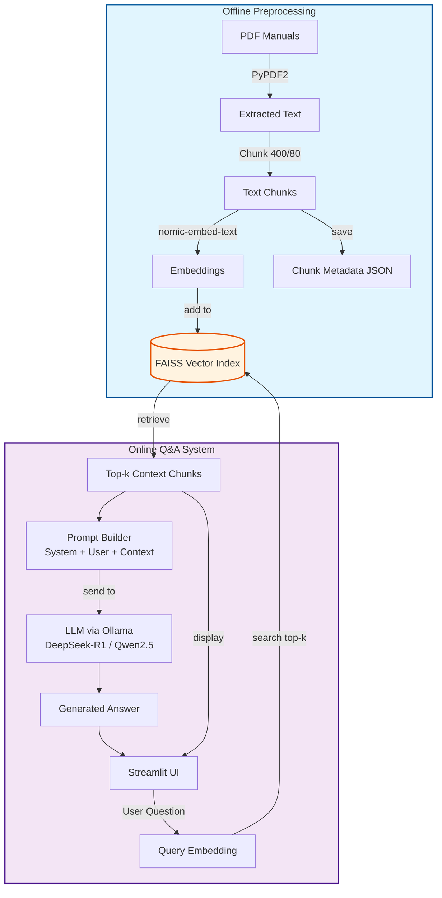

```mermaid
flowchart TB
    %% Offline Preprocessing (Left Side)
    subgraph Offline[Offline Preprocessing]
        A[PDF Manuals] -->|PyPDF2| B[Extracted Text]
        B -->|Chunk 400/80| C[Text Chunks]
        C -->|nomic-embed-text| D[Embeddings]
        D -->|add to| E[(FAISS Vector Index)]
        C -->|save| F[Chunk Metadata JSON]
    end

    %% Online Q&A (Right Side)  
    subgraph Online[Online Q&A System]
        G[Streamlit UI] -->|User Question| H[Query Embedding]
        H -->|search top-k| E
        E -->|retrieve| I[Top-k Context Chunks]
        I --> J[Prompt Builder<br/>System + User + Context]
        J -->|send to| K[LLM via Ollama<br/>DeepSeek-R1 / Qwen2.5]
        K --> L[Generated Answer]
        L --> G
        I -->|display| G
    end

    %% Styling for better visual separation
    classDef offlineStyle fill:#e1f5fe,stroke:#01579b,stroke-width:2px
    classDef onlineStyle fill:#f3e5f5,stroke:#4a148c,stroke-width:2px
    classDef storageStyle fill:#fff3e0,stroke:#e65100,stroke-width:2px
    
    class Offline offlineStyle
    class Online onlineStyle
    class E storageStyle
```
