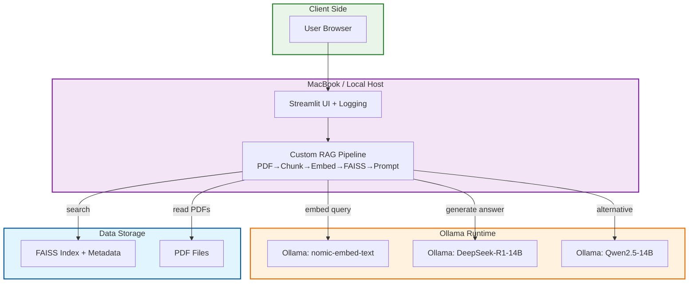

```mermaid
graph TB
    %% Client Side
    Browser[User Browser]
    
    %% Host Side - 简化结构，避免嵌套子图
    UI[Streamlit UI + Logging]
    RAG[Custom RAG Pipeline<br/>PDF→Chunk→Embed→FAISS→Prompt]
    EMBM[Ollama: nomic-embed-text]
    LLM1[Ollama: DeepSeek-R1-14B]
    LLM2[Ollama: Qwen2.5-14B]
    Vec[FAISS Index + Metadata]
    Files[PDF Files]
    
    %% 分组框（使用虚线框模拟子图）
    subgraph ClientSide[Client Side]
        Browser
    end
    
    subgraph HostSide[MacBook / Local Host]
        UI
        RAG
    end
    
    subgraph OllamaRuntime[Ollama Runtime]
        EMBM
        LLM1
        LLM2
    end
    
    subgraph DataStorage[Data Storage]
        Vec
        Files
    end

    %% 连接关系
    Browser --> UI
    UI --> RAG
    RAG -->|embed query| EMBM
    RAG -->|generate answer| LLM1
    RAG -->|alternative| LLM2
    RAG -->|search| Vec
    RAG -->|read PDFs| Files
    
    %% 样式定义
    classDef client fill:#e8f5e8,stroke:#2e7d32,stroke-width:2px
    classDef host fill:#f3e5f5,stroke:#7b1fa2,stroke-width:2px
    classDef ollama fill:#fff3e0,stroke:#ef6c00,stroke-width:2px
    classDef storage fill:#e1f5fe,stroke:#01579b,stroke-width:2px
    
    class ClientSide client
    class HostSide host
    class OllamaRuntime ollama
    class DataStorage storage
```
