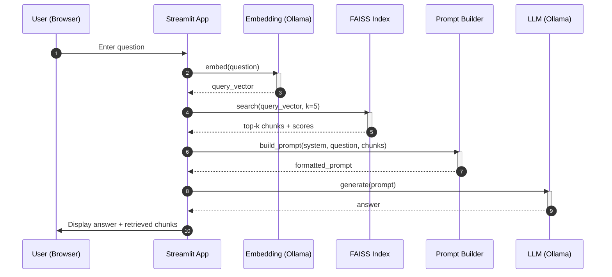

```mermaid
sequenceDiagram
    autonumber
    participant U as User (Browser)
    participant S as Streamlit App
    participant E as Embedding (Ollama)
    participant I as FAISS Index
    participant P as Prompt Builder
    participant L as LLM (Ollama)

    U->>S: Enter question
    S->>E: embed(question)
    activate E
    E-->>S: query_vector
    deactivate E
    
    S->>I: search(query_vector, k=5)
    activate I
    I-->>S: top-k chunks + scores
    deactivate I
    
    S->>P: build_prompt(system, question, chunks)
    activate P
    P-->>S: formatted_prompt
    deactivate P
    
    S->>L: generate(prompt)
    activate L
    L-->>S: answer
    deactivate L
    
    S->>U: Display answer + retrieved chunks
```
